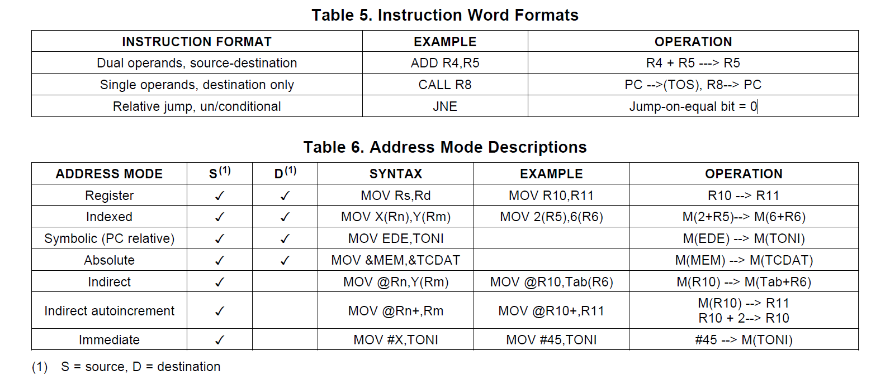
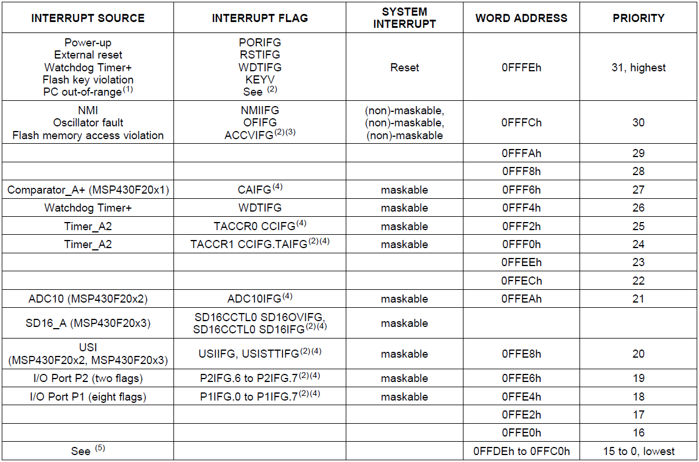
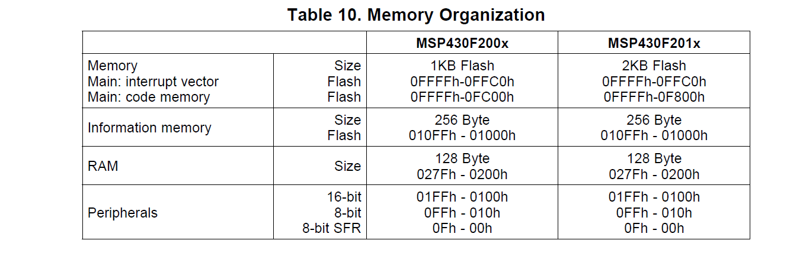
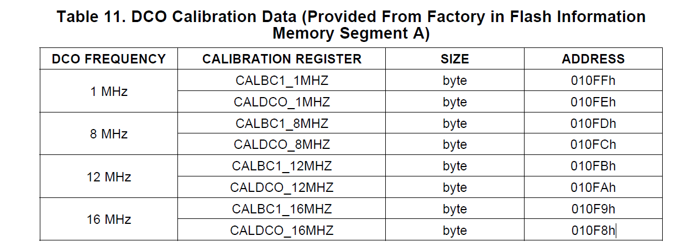
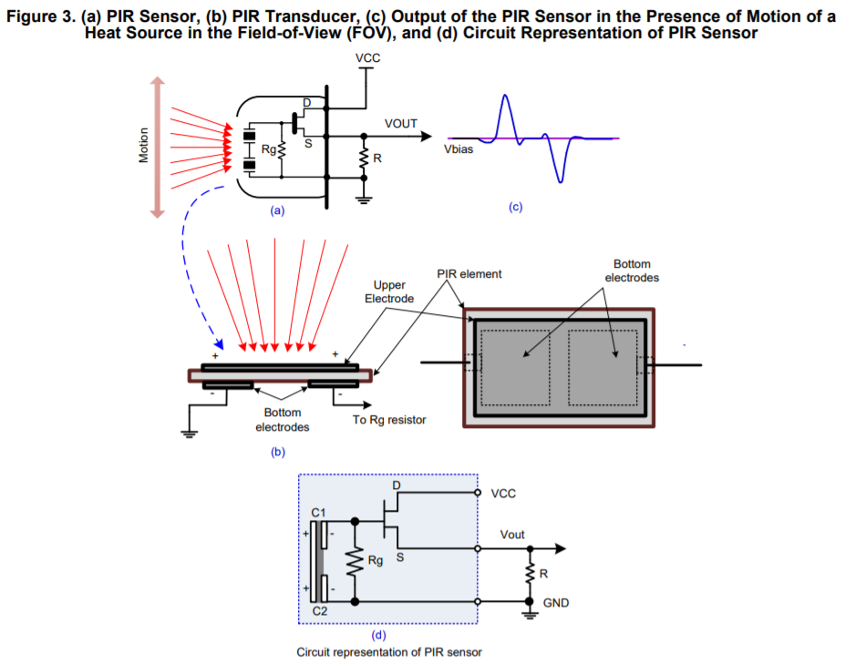
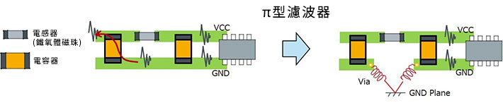

# MSP430F2013

1. MSP430F20x3家族特色: 具有16-bit sigma-delta A/D converter(差動輸入)
2. 16個暫存器
   > R0 __ program counter 
   > R1 __ stack pointer   
   > R2 __ status register    
   > R3 __ constant generator    
   > R4~R15 __ general-purpose registers     
      
3. Instruction Set(指令集)

4. Operating Modes
   MSP430有五種低功耗工作模式。透過中斷可以將設備從五個低功耗模式中喚醒，處理請求並恢復到從中斷程序返回時進入低功耗模式。
   
   • Active mode (AM)    
   – All clocks are active    
   • Low-power mode 0 (LPM0)    
   – CPU is disabled    
   – ACLK and SMCLK remain active    
   – MCLK is disabled    
   • Low-power mode 1 (LPM1)    
   – CPU is disabled    
   – ACLK and SMCLK remain active. MCLK is disabled    
   – DCO's dc-generator is disabled if DCO not used in active mode    
   • Low-power mode 2 (LPM2)    
   – CPU is disabled    
   – MCLK and SMCLK are disabled    
   – DCO's dc-generator remains enabled    
   – ACLK remains active    
   • Low-power mode 3 (LPM3)    
   – CPU is disabled    
   – MCLK and SMCLK are disabled    
   – DCO's dc-generator is disabled    
   – ACLK remains active    
   • Low-power mode 4 (LPM4)    
   – CPU is disabled    
   – ACLK is disabled    
   – MCLK and SMCLK are disabled    
   – DCO's dc-generator is disabled    
   – Crystal oscillator is stopped    
   
5. Interrupt Vector Addresses(中斷向量位址) address range of 0FFFFh to 0FFC0h.

6. Special Function Registers:
    
    PUC ("Power Up Clear") 上電清除信號.
    POR ("Power On Reset") 重置信號.
    
    00h-bit0 WDTIE Watchdog Timer interrupt enable. Inactive if watchdog mode is selected. Active if Watchdog Timer is configured in interval timer mode.    
    00h-bit1 OFIE Oscillator fault interrupt enable.    
    00h-bit4 NMIIE (Non)maskable interrupt enable.    
    00h-bit5 ACCVIE Flash access violation interrupt enable.    
    
    02h-bit0 WDTIFG Set on watchdog timer overflow (in watchdog mode) or security key violation. Reset on VCC power-on or a reset    
             condition at the RST/NMI pin in reset mode.    
    02h-bit1 OFIFG Flag set on oscillator fault.    
    02h-bit2 PORIFG Power-On Reset interrupt flag. Set on VCC power-up.    
    02h-bit3 RSTIFG External reset interrupt flag. Set on a reset condition at RST/NMI pin in reset mode. Reset on VCC power-up.    
    02h-bit4 NMIIFG Set via RST/NMI pin.    
    
7. Memory Organization

8. System clock 

 • Auxiliary clock (ACLK), sourced either from a 32768-Hz watch crystal or the internal LF oscillator.    
 • Main clock (MCLK), the system clock used by the CPU. 主時脈工廠預設16M    
 • Sub-Main clock (SMCLK), the sub-system clock used by the peripheral modules.外設用    
 
 
 
 9. Brownout 掉電保護    
      The brownout circuit is implemented to provide the proper internal reset signal to the device during power on and
      power off.    
 
 10. Digital I/O
 There is one 8-bit I/O port implemented—port P1—and two bits of I/O port P2:    
* All individual I/O bits are independently programmable.
* Any combination of input, output, and interrupt condition is possible.
* Edge-selectable interrupt input capability for all the eight bits of port P1 and the two bits of port P2.
* Read and write access to port-control registers is supported by all instructions.
* Each I/O has an individually programmable pullup or pulldown resistor.

11. Watchdog Timer (WDT+)看門狗
   主要功能是在以下情況下執行系統重置：   
   - 出現軟體問題。如果選擇的時間間隔到期，則會生成系統重置。如果看門狗 
   - 不需要時，可以禁用或將其配置為間隔計時器，並且在選定的時間間隔生成中斷。 
    

# IAR embedded workbench
 1. download: https://www.iar.com/iar-embedded-workbench/#!?architecture=MSP430
 2. tutorial: https://youtu.be/9QzkK1CaEmM
 3. visual c++ redistributable: https://support.microsoft.com/zh-tw/help/2977003/the-latest-supported-visual-c-downloads
 4. User Guides: IAR Embedded Workbench for TI MSP430 https://www.iar.com/support/user-guides/user-guidesiar-embedded-workbench-for-ti-msp430/
 
# JTAG USB debug interface
 1. MSP-FET
 2. MSP-FET430UIF
 
 
# MSP430 USB Stick Development Tool
  EZ430-F2013
# Flash tools 
  UniFlash
  FlashPro-430 and GangPro-430
  
## 低雜音長距離 PIR sensor 電路設計與分析
 
 1. PIR 之信號應取交流之部分(C2 與 C6)，故必須提供1/2Vcc電壓(R2 and R3)。
 2. OPA開環路增益約為10^5，反饋電路降低整體電路的增益會使系統比較穩定。OPA的開環增益隨頻率快速的下降，限制頻寬(C4,C8)。
 3. OPA輸出加上RC Filter可以降低OPA輸出之雜音。
 4. Gain值可能會受到截止頻率之影響。
 5. Low pass 轉折頻率點設計在10HZ，反推回1/2PI* RC，約1.5K歐姆(R1,R6,R11)
 6. High pass 轉折頻率點設計在0.7HZ，約1.5K歐姆(R4,R9)
 7. 直流準位R2=R3=R7=R8=2R4=13.6K歐姆
 8. Gain 90dB=Gain/2=45dB=177.8*(Vout/Vin)，R5 =(Gain-1)* R4 ， R5= 1.2M歐姆
 9. C4,C8 = 1/(2PI * R5 * 10HZ) = 13nF，choose 15nF 
 
 ## 焦電型 PIR sensor RE200B 參數與分析
 
 1. 受光輻射限制在人體的輻射最敏感的8至14mm範圍。
 2. JFET S極端子pin2通常通過大約100 K的下拉電阻接地，並放大信號其增益為10,000，在其輸出端產生從0到Vcc的過渡。
 3. 應將濾波良好的3至15 volts 連接到JFET D極 pin1。Datasheet使用CRC PI型filter。
 4. 放大器的頻寬通常限制為大約10Hz以阻絕高頻雜訊(1/f)。
 5. RE200B TO5 package。
 6. PIR sensor 本體是由一個N通道JFET構成的共汲極放大器(common-drain)
 * 根據原理圖，受光面積通過凸透鏡產生更大之角度，而離目標越遠則輸出訊號頻率越低，反之越靠近感測器則頻率越高
 * 感測信號強度與距離成反比
 * 物體移動速度與頻率成正比，也就是說距離越遠則物體移動越快越容易被偵測到
 
 
 
 

## 市售模組 HC-SR505 參數與分析
 
1. Gain = 20 * (3M/10k) = 6000, IC內部有20倍放大OPA輸入
2. 實測距離約在2m~3m
3. 改動10K為5K後，實測可達3m~4m，再高容易誤報
* 內部PGA倍率越高，則雜訊可承受力越低，當適可而止
* 單端輸入之信號較難以改善從GND涉入之雜訊，理當考慮差動輸入

* CRC之PI型濾波，為了避免雜訊直接傳播，可利用Via的寄生電感的手法，經由過孔（Via）與GND平面連接，改善效果較好。
* 有些PCB板佈線佈局，會因串擾而導致濾波效果下降。
* π型濾波器的電容的GND的某些設置方法可能會帶來地線反彈雜訊。
* 優化PCB板佈線佈局可避免這些問題。
* 不要將大容量輸入電容器放置在輸入電源和地之間，而是將其放置在降壓轉換器IC（例如LT1765）的輸入和接地引腳之間。結果是輸出端的電壓紋波明顯降低，電路設計更簡單    

 
 
 # 菲涅耳透鏡（Frenzel Lens）作為空間之補償
 
   
