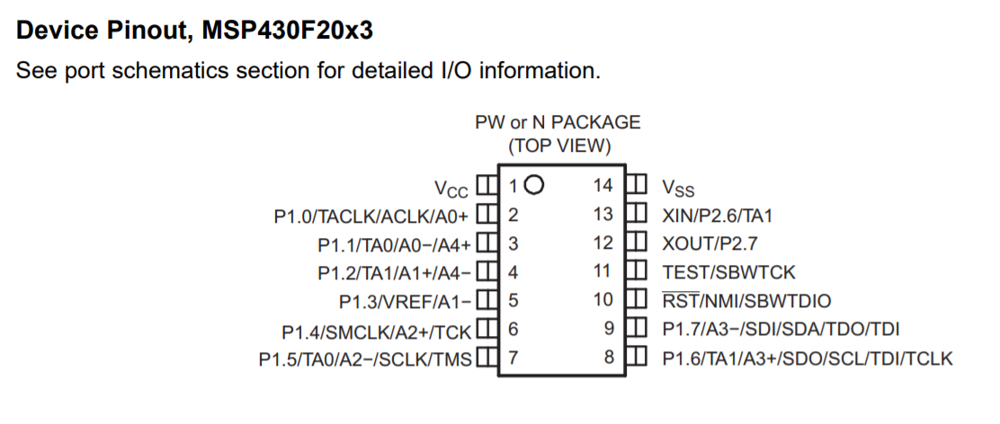
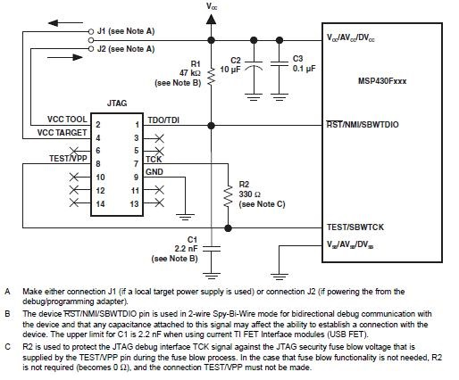

# MSP430F2013

# IAR embedded workbench
 1. download: https://www.iar.com/iar-embedded-workbench/#!?architecture=MSP430
 2. tutorial: https://youtu.be/9QzkK1CaEmM
 3. visual c++ redistributable: https://support.microsoft.com/zh-tw/help/2977003/the-latest-supported-visual-c-downloads
 4. User Guides: IAR Embedded Workbench for TI MSP430 https://www.iar.com/support/user-guides/user-guidesiar-embedded-workbench-for-ti-msp430/
 
# JTAG USB debug interface
 1. MSP-FET
 2. MSP-FET430UIF
 
 
# MSP430 USB Stick Development Tool
  EZ430-F2013
# Flash tools 
  UniFlash
  FlashPro-430 and GangPro-430
 
  
