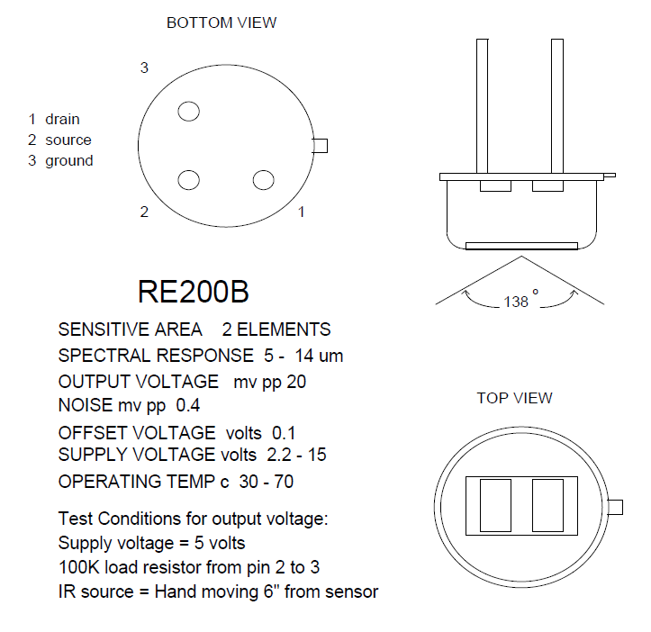

# MSP430F2013

# IAR embedded workbench
 1. download: https://www.iar.com/iar-embedded-workbench/#!?architecture=MSP430
 2. tutorial: https://youtu.be/9QzkK1CaEmM
 3. visual c++ redistributable: https://support.microsoft.com/zh-tw/help/2977003/the-latest-supported-visual-c-downloads
 4. User Guides: IAR Embedded Workbench for TI MSP430 https://www.iar.com/support/user-guides/user-guidesiar-embedded-workbench-for-ti-msp430/
 
# JTAG USB debug interface
 1. MSP-FET
 2. MSP-FET430UIF
 
 
# MSP430 USB Stick Development Tool
  EZ430-F2013
# Flash tools 
  UniFlash
  FlashPro-430 and GangPro-430
  
## 低雜音長距離 PIR sensor 電路設計與分析
 
 1. PIR 之信號應取交流之部分(C2 與 C6)，故必須提供1/2Vcc電壓(R2 and R3)。
 2. OPA開環路增益約為10^5，反饋電路降低整體電路的增益會使系統比較穩定。OPA的開環增益隨頻率快速的下降，限制頻寬(C4,C8)。
 3. OPA輸出加上RC Filter可以降低OPA輸出之雜音。
 4. Gain值可能會受到截止頻率之影響。
 5. Low pass 轉折頻率點設計在10HZ，反推回1/2PI* RC，約1.5K歐姆(R1,R6,R11)
 6. High pass 轉折頻率點設計在0.7HZ，約1.5K歐姆(R4,R9)
 7. 直流準位R2=R3=R7=R8=2R4=13.6K歐姆
 8. Gain 90dB=Gain/2=45dB=177.8*(Vout/Vin)，R5 =(Gain-1)* R4 ， R5= 1.2M歐姆
 9. C4,C8 = 1/(2PI * R5 * 10HZ) = 13nF，choose 15nF 
 
 ## 焦電型 PIR sensor RE200B 參數與分析
 
 1. 受光輻射限制在人體的輻射最敏感的8至14mm範圍。
 2. JFET S極端子pin2通常通過大約100 K的下拉電阻接地，並放大信號其增益為10,000，在其輸出端產生從0到Vcc的過渡。
 3. 應將濾波良好的3至15 volts 連接到JFET D極 pin1。Datasheet使用CRC PI型filter。
 4. 放大器的頻寬通常限制為大約10Hz以阻絕高頻雜訊。
 5. RE200B TO5 package。
 6. PIR sensor 本體是由一個N通道JFET構成的共汲極放大器(common-drain)
 * 根據原理圖，受光面積通過凸透鏡產生更大之角度，而離目標越遠則輸出訊號頻率越低，反之越靠近感測器則頻率越高
 * 感測信號強度與距離成反比
 * 物體移動速度與頻率成正比，也就是說距離越遠則物體移動越快越容易被偵測到
 
 
 

## 市售模組 HC-SR505 參數與分析
 
1. Gain = 20 * (3M/10k) = 6000, IC內部有20倍放大OPA輸入
2. 實測距離約在2m~3m
3. 改動10K為5K後，實測可達3m~4m，再高容易誤報
* 內部PGA倍率越高，則雜訊可承受力越低，當適可而止

 
 
 # 菲涅耳透鏡（Frenzel Lens）作為空間之補償
 
   
